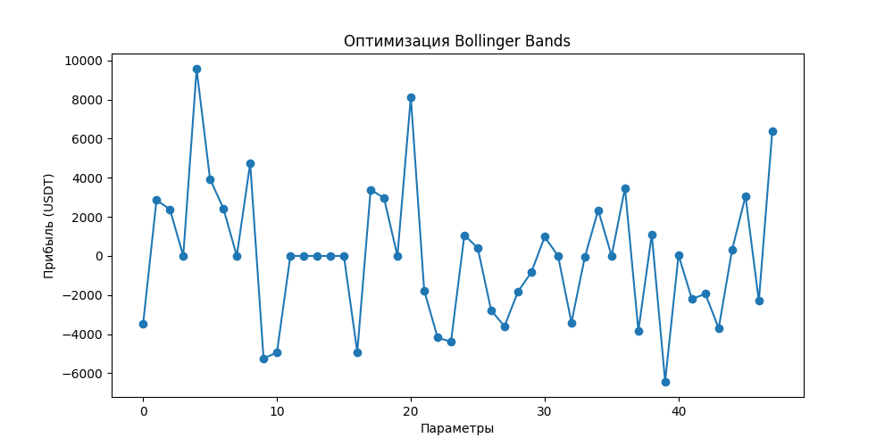
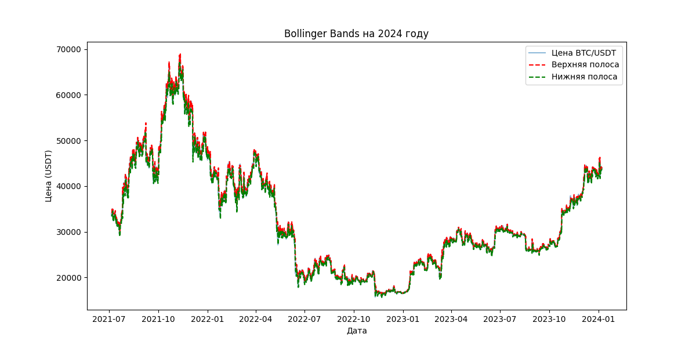
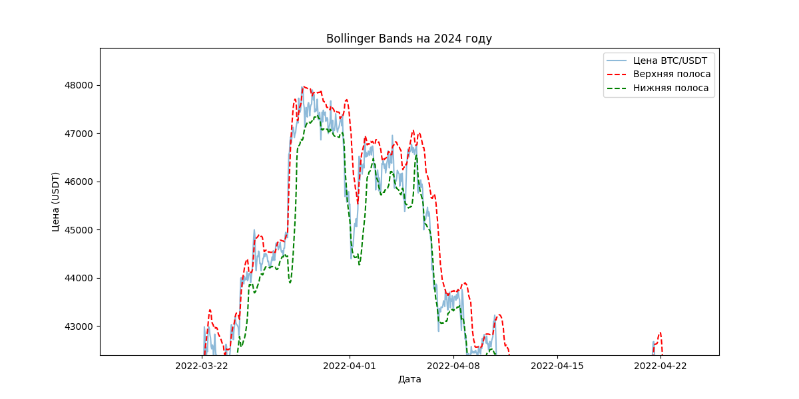

# Отчет по тестированию торговых стратегий

## 1. Введение
Проведен тест трех стратегий на данных BTC/USDT (2021-2023), оптимизированы параметры с помощью жадного алгоритма и перебора. Итоговые стратегии протестированы на 2024 году.

## 2. Стратегии
- **EMA** – торговля на пересечении EMA короткого и длинного.
- **RSI + ATR** – вход по RSI в зоне перепроданности/перекупленности, фильтрация ATR.
- **Bollinger Bands** – сигналы на границах Боллинджера, фильтр по SMA.

## 3. Оптимальные параметры
| Стратегия | Лучшие параметры     | Прибыль (USDT) |
|---------|-------------------|--------------|
| EMA     | EMA 10/35         | 6066.10     |
| RSI + ATR | RSI 35/65, ATR 1.0 | 3273.01     |
| Bollinger | SMA 30, BB 15, Std 1.5 | 9559.11 |

## 4. Графики

### Оптимизация EMA

### Оптимизация RSI + ATR

### Оптимизация Bollinger Bands

### Тестирование Bollinger  Bands на 2024 годду

## 5. Вывод
Лучшая стратегия – **Bollinger Bands** (9559.11 USDT).  

